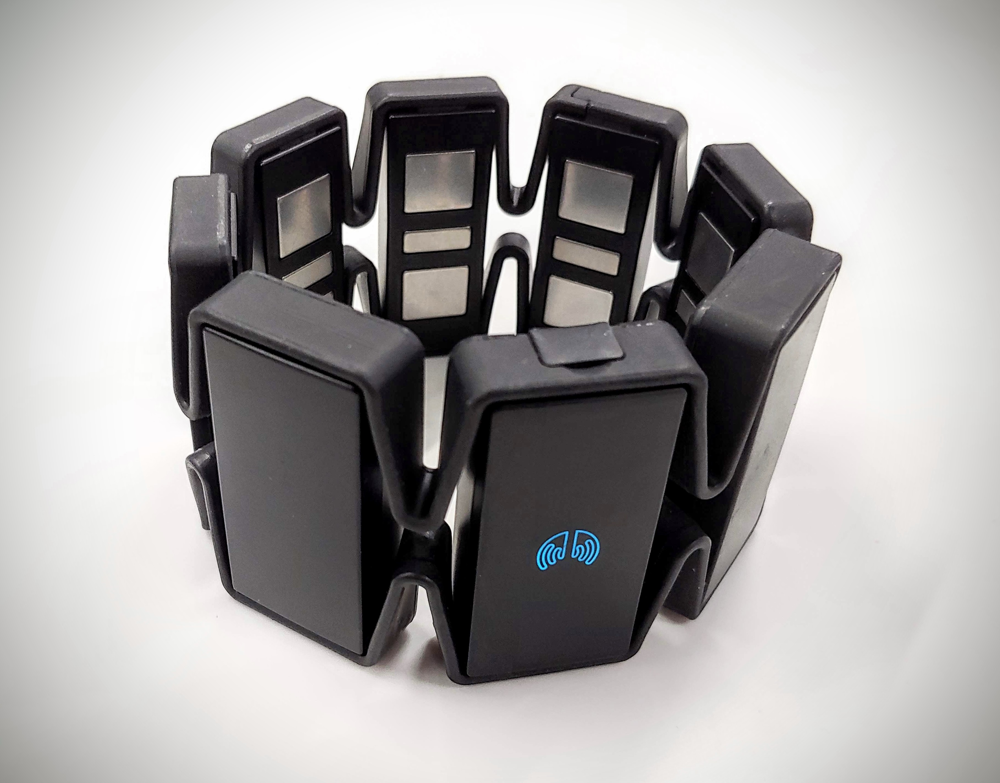

# Data Acquisition
This section of the project is dedicated to gathering processing data for use in training of the models. SEMG data is gathered from the myo and the hand point cloud data is gathered from the leap cameras for labeling. A simple utility is provided to join both of these data sets into a single unified file for use in training models. This format is also accepted for visualization and playback  by `render_from_data.py` in the 'app' section.

During the development of the models included with this project data sets were captured in 30 minute periods, with each dataset typically focusing on a simple movement, such as one for movement of the index finger, one for the ring finger, one for all fingers, etc..
Combinations of these models would then be joined for use in training the larger models.

## Myo
This application will connect to a myo and gather 8 channels of sEMG data. Upon SIG-INT interuption of the python script (ctrl-c) all collected data will be saved to a csv.

### Requirements
This has only been tested on debian and ubuntu families of linux.
* python 3.7 and up
* bluepy
* pandas
* numpy

These can all be installed from the 'app' directory requirements file.

### Usage
`./myo [-name name] [-nbr number]`

A csv dataset will be saved in the working directory with a time stamp and the optional name and number name values.

### Limitations
* Currently does not work with multiple myos. It appears bluepy can only listen to one connection at a time, and switching back and forth quickly seems to cause both myos to glitch.

* Currently has a list of handles to read/write from, rather than using the uuids. It's possible, though unlikely, that a future firmware update will change those handles, in which case they would need to be updated in the code.

* Can't provide emg and pose data at the same time. Currently, it provides emg until it's synced, then provides poses instead.

## Leap
This application will subscribe to data requests from the leap daemon, extract the relevant 63 position values from the returned data object and log these values. Upon SIG-INT these values will be saved to a csv file.

Note - Upon receiving SIG-INT the script will begin writing data to a file. While this is happening events from the leap will still be displayed on the terminal giving the impression that termination is not happening. In fact it is, if another SIG-INT is transmitted then the saving of the file will also be terminated and no data will be saved.

Current leap drivers no longer support MacOS and linux. A older no longer supported driver setup had to be used for this project. The setup works by running the leap daemon which will connect to the leap hardware. Processes can subscribe to events from the daemon. These processes will then be delivered a data object when one becomes available from the hardware. The included application will watch for these data objects, then if a right hand is present in the visual field, extract the 63 positional points and log them.

### Requirements

This setup uses a compiled dynamic lib for event subscription and another compiled library for anchoring python bindings and making the data available in the python runtime. These bindings were generated with SWIG on Ubuntu 19.04 and CPython 3.7.
On different systems the LeapPython.so library may need to be recompiled.

* python 3
* numpy
* pandas
* Leap SDK v2.3.1 [Download Here](https://developer.leapmotion.com/sdk/v2)

### Usage
Start the leap daemon: `leapd`

Start data collection with the `./setup.sh name nbr`

The name and nbr fields are just used for csv naming. A setup script is used for preloading the python instance with linking to the LeapLib object.

## Stitching
The ML pipeline requires sEMG data (features) and leap position data (labels) to train. A stitching script is included to join leap and myo data into a single data set of the correct format.

Because these hardware devices operate at different sampling rates and closely correlated samples are required for training, some processing is required. This script will crop the data sets to start and finish at the same time, prune the data set to find leap data points that correlate as closely as possible to each emg point, format everything properly and save to a single csv.

### Usage
`usage: ./join_csvs.py leap_data emg_data out_file`

The implementation assumes that the emg data begins before the leap data.

